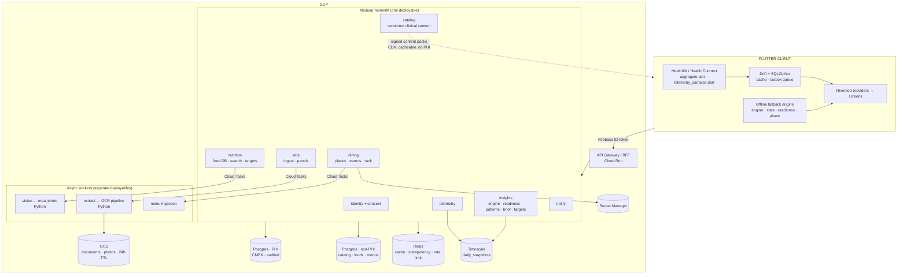

# Backend Architecture

Status: **proposal** · Target: migrate the majority of `lib/features/` logic to a
server-authoritative backend, with the Flutter client retained as an offline
fallback.

---

## 1. Why migrate at all

Today the app is a thick client with a thin backend. Firestore holds one
document (`health_profiles/{uid}`), Firebase Auth signs in anonymously, and
everything else — 6,646 lines of clinical and nutritional logic — lives in
`lib/features/` and `lib/core/`.

That was the right shape for a demo. It is the wrong shape for a product, for
five reasons:

1. **Clinical content cannot ship.** `reference_ranges.dart` (466 lines) and
   `rules.dart` (1,114 lines) encode medical opinion. When evidence tightens an
   optimal ferritin band, that change currently requires an App Store release
   and a review cycle. A bad threshold cannot be rolled back in under a week.
2. **Three features are self-documented stubs that need server compute.**
   `lab_parser.dart:11` — *"THE LOCAL PARSER DOES NOT READ THE DOCUMENT."*
   `suggest_plate.dart:8` — *"THIS DOES NOT LOOK AT THE PHOTO."*
   `rank.dart:19` — *"No menu is scraped."* No amount of client work fixes
   these; they need OCR, vision, and a menu corpus.
3. **Reference data is hardcoded.** `food_database.dart` is 900 lines of literal
   food entries. A real logger needs search, brands, barcodes, regional foods,
   and portion variants — a database, not a Dart file.
4. **Insights are unauditable and unreproducible.** If a user asks why the app
   flagged something on 3 March, there is no record. For anything adjacent to
   clinical advice, being unable to reconstruct a claim is a liability.
5. **A secret is compiled into the binary.** `places.dart:28` reads
   `PLACES_API_KEY` via `String.fromEnvironment`, which lands in the IPA in
   plaintext.

## 2. The decision, and its cost

> **The backend becomes the system of record and the authority for all derived
> health intelligence. The device becomes a cache, a sensor adapter, and an
> offline fallback.**

The cost, stated plainly: the correlation engine's inputs are HRV, resting heart
rate, sleep stages, menstrual cycle and blood biomarkers. Moving the engine
means syncing all of it. **This makes the platform a controller of special-
category health data** — GDPR Art. 9, India's DPDP Act, and HIPAA if US
covered entities are ever involved. §8 designs for that obligation instead of
pretending it away. It is real work: consent ledger, encryption at rest with
customer-managed keys, audited data access, breach procedures, retention
policy, DPO.

Accepting that cost buys: instant clinical-content updates, cohort-relative
baselines, an ML upgrade path, reproducible insights, cross-device continuity,
server-side vision and OCR, and honest menu data.

## 3. Migration inventory

Every file in `lib/features/` and `lib/core/stats/`, with its disposition.

### Move fully to backend — 4,014 lines

| Module | LOC | Why it moves |
|---|---:|---|
| `correlation/rules.dart` | 1,114 | Clinical content. Must be updatable, versioned, auditable. |
| `nutrition/food_database.dart` | 900 | Becomes a real nutrition DB with search and barcodes. |
| `brief/compose.dart` | 581 | Needs full history; enables LLM narrative later; must be reproducible. |
| `labs/reference_ranges.dart` | 466 | Clinical content, same reasoning as rules. |
| `nutrition/patterns.dart` | 428 | Weekly analysis over full history. |
| `dining/rank.dart` | 346 | Needs a real menu corpus, not cuisine-inferred dishes. |
| `labs/lab_parser.dart` | 327 | Stub. Requires OCR. |
| `dining/places.dart` | 230 | Key must leave the binary. |
| `nutrition/suggest_plate.dart` | 210 | Stub. Requires a vision model. |
| `nutrition/targets.dart` | 209 | Published equations, but co-locates with brief + patterns. |
| `dining/fixtures.dart` | 120 | Becomes a served content pack (small bundled fallback retained). |
| `nutrition/demo_seed.dart` | 141 | Dev-only. Becomes a seed script. |

### Move, but keep the Dart implementation as offline fallback — 1,164 lines

| Module | LOC | Rationale |
|---|---:|---|
| `correlation/engine.dart` | 227 | Server authoritative for cohort baselines, ML, versioning. |
| `correlation/engine_context.dart` | 222 | Windowing and z-scores; moves with the engine. |
| `core/stats/stats.dart` | 255 | Pure kernel; reimplemented server-side, kept client-side. |
| `correlation/readiness_calculator.dart` | 92 | Weights become tunable server-side content. |
| `cycle/menstrual_phase.dart` | 268 | Server needs it for targets/brief; client needs it offline. |

These are *pure and already tested* (`test/features/correlation/engine_test.dart`,
`test/stats_test.dart`), which makes them ideal fallbacks: nearly free to keep,
and they become the conformance oracle for the server port (§9).

### Stays on device permanently — 510 lines

| Module | LOC | Why it cannot move |
|---|---:|---|
| `health/aggregate.dart` | 306 | HealthKit is only readable in-process on the device. Apple's terms also forbid shipping raw HealthKit data to a server for anything but the user's own benefit. This produces the `DailySnapshot` that gets synced. |
| `health/telemetry_samples.dart` | 90 | Sample-level adapter, same constraint. |
| `core/util/iso_day.dart` | 114 | Shared utility; implemented on both sides. |

Also staying: everything in `lib/presentation/` and `lib/core/theme/`,
`lib/data/health/*` (the `HealthProvider` adapters).

**Net: ~4,000 lines migrate outright, ~1,160 become dual-implementation,
~510 stay.**

## 4. System diagram



## 5. Service responsibilities

**Modular monolith, not microservices.** Ten separately deployed services for a
team this size buys distributed-systems problems and no benefit. One deployable
with enforced module boundaries — no cross-module imports except through a
declared interface — plus separately scaled async workers, because OCR and
vision have wildly different resource profiles from request handling. Split
later only where load genuinely diverges.

| Module | Owns | Key endpoints |
|---|---|---|
| `identity` | Accounts, anonymous→Apple/Google upgrade, consent ledger | `POST /v1/auth/link`, `GET/POST /v1/consent` |
| `telemetry` | `DailySnapshot` ingestion, revision history | `POST /v1/telemetry/snapshots` (batch, idempotent) |
| `insights` | Correlation engine, readiness, patterns, targets, brief | `GET /v1/insights`, `GET /v1/readiness`, `GET /v1/brief/{day}`, `GET /v1/targets` |
| `labs` | Document ingest, panel storage, review corrections | `POST /v1/labs/uploads`, `GET /v1/labs/reports`, `PATCH /v1/labs/reports/{id}/biomarkers` |
| `nutrition` | Food search, barcode, meal log, photo recognition | `GET /v1/foods?q=`, `GET /v1/foods/barcode/{ean}`, `POST /v1/meals`, `POST /v1/meals/recognise` |
| `dining` | Places proxy, menu corpus, dish ranking | `POST /v1/dining/nearby`, `GET /v1/dining/{id}/dishes` |
| `catalog` | Versioned clinical + reference content | `GET /catalog/v1/manifest`, `GET /catalog/v1/{pack}/{version}` |
| `notify` | Push registration, morning brief scheduling | `POST /v1/devices`, internal cron |

## 6. The extraction pipeline

The single highest-value component. Four layers, cheapest first.

| Layer | Handles | Implementation |
|---|---|---|
| **L1 · text layer** | Digital PDFs | `pdfplumber` + per-lab table templates. Most reports from Thyrocare, Dr Lal PathLabs, Metropolis, Quest are generated PDFs with an intact text layer. Near-free, ~99% accurate, covers the majority. **Build first.** |
| **L2 · OCR** | Photos, scans | Document AI (table-aware). Invoked only when L1 yields nothing. |
| **L3 · LLM normalise** | Name→code, unit conversion | Claude with forced JSON schema mirroring `Biomarker`. Maps `"25-OH Vitamin D (Total)"` → `vitaminD`, `nmol/L` → `ng/mL`. |
| **L4 · validation** | Safety net | Pure deterministic code, no model. |

**Hard rule for L3: the model may map names and convert units. It must never
originate a numeric value.** Every number traces to L1/L2 extraction with a
`sourcePage`. An LLM hallucinating ferritin 12 for 120 is clinical harm, not a
quality regression. Enforce structurally — the model receives extracted
`(name, value, unit)` tuples and returns a mapping, never free text.

L4 exploits redundancy inherent in blood panels:

- Per-analyte physiological plausibility bounds (reject HbA1c 450 — a decimal slip)
- Friedewald: `LDL ≈ TC − HDL − TG/5`
- `TSat = serum iron / TIBC`; recompute `eGFR` from creatinine + age + sex
- Unit-magnitude sanity — catches the classic B12 `pmol/L` vs `pg/mL` confusion

Failures set `confidence < 0.7` → `ParseStatus.needsReview`. **The client already
renders this state** (`biomarker.dart:confidence` — *"Below 0.7 the UI asks the
user to confirm"*). No new frontend required.

**Ship the human review queue in the first release.** Route every `needsReview`
to an internal tool. Operator corrections are simultaneously the user's fix,
your labelled training set, and your per-lab template library. This is the
flywheel, and the reason extraction must be a versioned service rather than a
prompt inline in a handler.

## 7. Data model

PHI and non-PHI live in **separate Postgres instances**, not separate schemas.
The blast radius of a misconfigured grant should not include blood results.

```sql
-- ══ PHI instance · CMEK · every read audited ══

users (id, firebase_uid, created_at, deleted_at)
consents (id, user_id, policy_version, scope, granted_at, revoked_at)  -- append-only

profiles (user_id, sex, dob, height_cm, weight_kg, goals[], diet_pattern,
          allergies[], cuisines[], cycle_profile, updated_at)

-- Append-only. HealthKit revises and backfills; never UPDATE in place.
daily_snapshots (user_id, day, revision, source, hrv, resting_hr,
                 sleep_asleep_min, sleep_efficiency, sleep_stages jsonb,
                 active_energy, steps, ingested_at,
                 PRIMARY KEY (user_id, day, revision))

lab_reports (id, user_id, source, status, collected_at, uploaded_at,
             lab_name, panel_name, file_name, file_size_bytes,
             extractor_version, error, warnings[])
biomarkers (report_id, code, raw_name, display_name, category,
            value NUMERIC, unit, range jsonb, flag, confidence,
            source_page, corrected_by, corrected_at)

meals (id, user_id, day, slot, logged_at, photo_ref, source)
meal_items (meal_id, food_id, portion_g, macros jsonb)
hydration (user_id, day, ml)

-- Reproducibility: replay any insight ever shown to any user.
insights (id, user_id, day, kind, payload jsonb,
          engine_version, rules_pack_version, catalog_version,
          input_digest, computed_at)

-- ══ Non-PHI instance · no user data, aggressively cached ══

foods (id, name, brand, ean, cuisine, per_100g jsonb, source, verified)
food_aliases (food_id, alias, locale)
restaurants (id, place_id, name, geohash, cuisines[], updated_at)
menu_items (restaurant_id, name, price, macros jsonb, confidence, source)

catalog_packs (name, version, payload jsonb, signature, published_at)
extraction_templates (lab_name, version, spec jsonb)
golden_corpus (id, doc_ref, ground_truth jsonb, lab_name, source_type)
```

Three deliberate choices:

- **`daily_snapshots` is append-only with a `revision` column.** HealthKit
  backfills a watch that synced late and revises sleep after the fact. Mutating
  in place destroys the ability to explain why yesterday's readiness changed.
- **`insights` stores `engine_version`, `rules_pack_version`, `input_digest`.**
  This is the most valuable property in the schema. It answers "why did the app
  tell this user that, on that day, and would today's code still say it?"
- **`biomarkers.value` is `NUMERIC`, never float.** Clinical values do not get
  binary floating-point rounding.

## 8. Privacy, consent, compliance

Non-negotiable given §2.

- **Separate PHI instance**, customer-managed encryption keys, private VPC, no
  public IP. Application-level encryption on `biomarkers.value` and
  `daily_snapshots` columns, keys in Cloud KMS.
- **All PHI access through one data-access layer** that writes an audit row per
  read: who, which user, which fields, why. Direct SQL from handlers is a lint
  failure. Support staff reads are audited identically to user reads.
- **Zero PHI in logs, enforced mechanically.** A structured logger whose payload
  type cannot accept a `Biomarker` or `DailySnapshot`, plus a CI grep. Log
  `report_id`, `analyte_count`, `mean_confidence`, `duration_ms` — never a value.
- **Consent ledger is append-only** with versioned policy text. Granular scopes:
  telemetry sync, lab storage, cohort analytics, LLM processing. Each
  independently revocable, and revocation must actually stop the processing.
- **Retention.** Documents deleted from GCS 24h post-parse. Full account export
  (JSON) and hard delete within 30 days, cascading to backups.
- **HealthKit terms.** Raw HealthKit data may be used only for the user's own
  benefit — no advertising, no sale, no sharing with data brokers. Cohort
  baselines must be computed from de-identified aggregates, and that boundary
  belongs in code, not in a policy document.
- **Region pinning.** DPDP and GDPR both push toward in-region storage. Decide
  the primary region before the first byte of PHI lands.

## 9. Migration strategy — strangler, with the existing tests as the oracle

The repo has 15 test files, including `engine_test.dart`, `compose_test.dart`,
`patterns_test.dart`, `targets_test.dart`, `rank_test.dart`,
`reference_ranges_test.dart`, `menstrual_phase_test.dart`, `stats_test.dart`.
These are the migration's safety net. Per module:

1. **Port the Dart tests to the backend as a conformance suite.** Same fixtures,
   same expected outputs. The server port is correct when it passes what the
   Dart implementation passes.
2. **Stand up the endpoint** behind a remote feature flag, default off.
3. **Shadow mode.** Client calls the server *and* computes locally, renders the
   local result, and reports mismatches with the input digest. Run until the
   mismatch rate is negligible on real user data — this catches what fixtures
   never will.
4. **Flip the flag.** Server becomes authoritative; local becomes fallback.
5. **Demote or delete.** `rules.dart`, `food_database.dart`, `reference_ranges.dart`,
   `compose.dart`, `patterns.dart`, `rank.dart` get deleted. `engine.dart`,
   `stats.dart`, `readiness_calculator.dart`, `menstrual_phase.dart` stay as the
   offline path with a visible "computed on device" marker in the UI.

Shadow mode is what makes this safe. Skipping it means discovering divergence
through a user's incorrect health insight.

## 10. Offline behaviour

Non-negotiable for a health app — HealthKit keeps recording in a tunnel.

- **Reads:** every server response cached in Drift with a `computed_at` and the
  versions it used. Stale data renders with its age shown, never silently.
- **Insights:** on cache miss with no network, run the retained Dart engine and
  mark the output as device-computed.
- **Writes:** an **outbox queue** in Drift. Food log entries, hydration, period
  dates and lab corrections commit locally first and flush on reconnect, keyed
  by client-generated UUID so replay is idempotent.
- **Conflict resolution:** last-write-wins per entity using the client's
  monotonic revision. These are single-user, single-writer entities in practice;
  anything more elaborate is unwarranted complexity.

## 11. Technology

Firebase is already wired (`firebase_options.dart`, `firestore.rules`). Stay on
GCP; do not fragment the stack.

| Concern | Choice | Rationale |
|---|---|---|
| API runtime | **Cloud Run** | Containers, no function timeout ceiling, locally runnable. |
| API language | **TypeScript** · Fastify + zod | Decisive reason: the Dart files are annotated *"Ported from `src/schemas/*.ts`"* — **zod schemas already exist** in the React Native repo. Make them the single source of truth, derive OpenAPI, codegen the Dart client. One schema, no drift. |
| Workers | **Python** | Document/vision ecosystem. Clean seam: queue consumers, not handlers. |
| Queue | **Cloud Tasks** | Native retry with backoff, per-queue concurrency caps. Pub/Sub is overkill at this rate. |
| PHI store | **Cloud SQL Postgres** + Timescale | Relational, migratable, encryptable, auditable. |
| Non-PHI store | **Cloud SQL Postgres** (separate instance) | Catalog, foods, menus, corpus. |
| Cache | **Memorystore Redis** | Idempotency keys, rate limits, Places geohash cache. |
| Blobs | **GCS** + CMEK + 24h lifecycle | Documents are transient input, not assets. |
| Auth | **Keep Firebase Auth** | Already integrated; add Apple + Google via `linkWithCredential` so the anonymous uid upgrades in place — no data migration. Apple sign-in is mandatory if Google is offered (App Store 4.8). |
| Profile store | **Migrate off Firestore → Postgres** | Once PHI is relational, one store is better than two. Keep Firestore only for auth. |
| IaC | **Terraform** | PHI infrastructure must be reviewable and reproducible. |
| Contract | **OpenAPI → Dart codegen** | The `LabParser` implementation should be generated, not hand-written. |

## 12. Client-side work this implies

Beyond deleting migrated modules:

- **Replace `shared_preferences` with Drift + SQLCipher.** `prefs_lab_repository.dart`
  and `prefs_meal_log_repository.dart` store unencrypted JSON blobs — wrong for
  blood results, and unable to support an outbox queue or a query.
- **New repository implementations** behind the existing `lib/domain/repositories/`
  interfaces. The abstraction is already correct: `LabRepository`,
  `MealLogRepository`, `DailyStatsRepository` etc. become HTTP-backed with a
  cache. **The nine `mock_*` and `prefs_*` implementations get replaced, and no
  screen or provider changes.** This is the payoff for the existing structure.
- **Generated API client** from OpenAPI.
- **Sync orchestration** — a background `DailySnapshot` uploader, an outbox
  flusher, and catalog manifest checking on launch.
- **Signature verification for content packs** (Ed25519). An attacker who can
  swap the reference-range pack can tell a user that critically low ferritin is
  optimal. Verify, and fall back to the bundled asset on failure.

## 13. Phasing

| Phase | Scope | Duration | Unblocks |
|---|---|---|---|
| **0 · Harden** | Places proxy, Apple/Google sign-in with anonymous upgrade, `shared_preferences` → Drift/SQLCipher | ~1 wk | Removes a leaked key and a guaranteed data-loss bug. Ship-blockers, independent of everything else. |
| **1 · Foundation** | Terraform, PHI instance, gateway, identity, consent ledger, OpenAPI + codegen, CI | 3–4 wks | Everything downstream. |
| **2 · Extraction** | Ingest, L1, L4, review queue, golden corpus | 4–6 wks | The core product promise. L1 alone covers most real reports. |
| **3 · Catalog** | Content packs, signing, admin authoring, client fetch | 2 wks | Clinical updates without App Store review. Do this before the engine moves. |
| **4 · Telemetry + insights** | Snapshot sync, engine/readiness/patterns/targets port, shadow mode | 5–6 wks | The main migration. Gated on §9 shadow results. |
| **5 · Nutrition** | Food DB import (USDA FDC + IFCT), search, barcode, meal log sync | 3–4 wks | Replaces the 900-line Dart table. |
| **6 · OCR + vision** | L2, L3, meal photo recognition | 3–4 wks | Photos of paper reports; `suggest_plate` becomes real. |
| **7 · Dining** | Menu corpus, server-side ranking | 3 wks | Real menus instead of cuisine-inferred dishes. |
| **8 · Brief** | Server composition, then optional LLM narrative | 2–3 wks | Last because it depends on every other module. |

Phase 3 precedes Phase 4 deliberately: get the ability to fix clinical content
remotely *before* the server owns clinical reasoning.

## 14. What makes this good rather than merely working

- **Golden corpus as the crown jewel.** 200–500 real reports per supported lab
  with hand-labelled ground truth. Every extractor change shadow-runs against
  it pre-deploy. North Star metric: **per-analyte extraction accuracy**,
  segmented by lab and by source type.
- **Reproducibility as a first-class feature.** `engine_version` +
  `rules_pack_version` + `input_digest` on every insight. Build the replay tool
  in Phase 4, not later — it is how you debug clinical complaints.
- **Idempotency everywhere**, keyed on client-generated UUIDs. A retry after a
  flaky connection must not duplicate a lab report or double-bill OCR.
- **No silent degradation.** Low confidence must surface as `needsReview`.
  `warnings[]` must render verbatim — `lab_parser.dart:19` notes the UI already
  does this. The client was built to be honest about uncertainty; the backend
  must not undermine that.
- **A data classification table in the repo**, one row per field, stating where
  it may live and why. New engineers default to the wrong answer otherwise.
- **Module boundaries enforced by tooling**, not convention — otherwise the
  modular monolith degrades into a monolith within two quarters.

## 15. Open questions

1. **Primary region?** Determines DPDP/GDPR posture and must be settled before
   any PHI is written.
2. **Does the React Native repo's `src/schemas/*.ts` still exist and is it
   maintained?** If yes, it is the schema source of truth and saves weeks. If it
   has diverged, generate from the Dart entities instead.
3. **Cohort baselines — in scope?** They are the strongest argument for
   server-side insights, but require a de-identification boundary and explicit
   consent scope.
4. **LLM-authored briefs?** `compose.dart:22` argues deliberately for composed
   over generated prose, on auditability grounds. That argument survives the
   migration. Recommend keeping composition deterministic and using an LLM only
   for phrasing variation over a fixed clause set, if at all.
5. **Regulatory classification.** Depending on market and claims, biomarker
   interpretation can edge toward Software as a Medical Device. Worth a legal
   read before Phase 4, not after.
